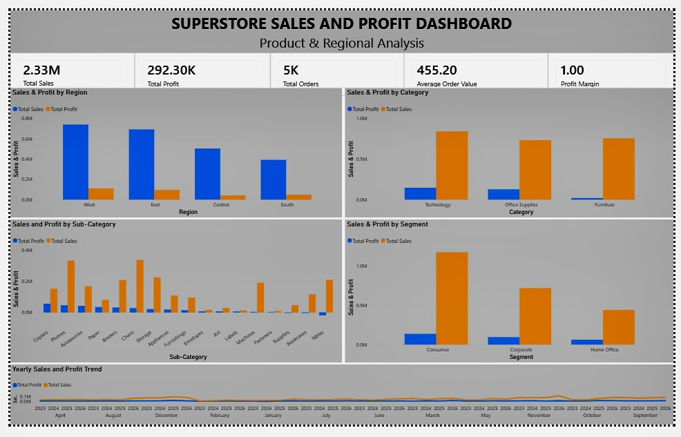
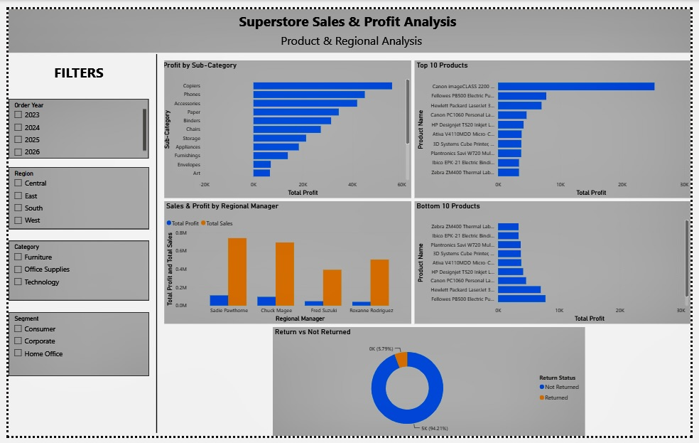
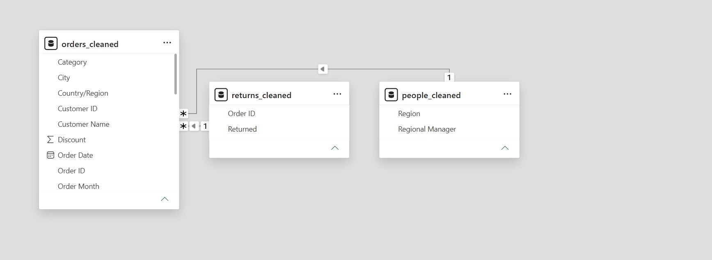

# Superstore_Sale_Analysis
End-to-end Superstore sales and profit analysis using Python, MySQL, and Power BI, covering data cleaning, exploratory analysis, SQL analysis, data modeling, and interactive dashboard development.

## Project Overview

This project analyzes retail transaction data to evaluate sales performance, profitability, product performance, customer segments, returns, and regional performance.

The project follows an end-to-end analytics workflow, from data cleaning and exploratory analysis to SQL-based analysis, data modeling, and interactive Power BI dashboard development.

## Objectives

- Analyze overall sales and profitability.
- Identify the highest- and lowest-performing products.
- Compare sales and profit across regions.
- Analyze category and sub-category performance.
- Compare customer segments.
- Analyze returned orders.
- Evaluate regional manager performance.
- Identify sales and profit trends over time.
- Present findings through an interactive Power BI dashboard.

## Tools & Technologies

- **Python** — Data cleaning and exploratory data analysis
- **Pandas** — Data manipulation and analysis
- **Matplotlib** — Data visualization
- **MySQL** — SQL analysis, aggregation, and table joins
- **SQLAlchemy** — Database connectivity and data loading
- **Power BI** — Data modeling, DAX, visualization, and dashboard development
- **GitHub** — Version control and project documentation

## Dataset

The project uses the Superstore dataset consisting of three related tables.

### Orders

Contains transactional information including:

- Order ID
- Order Date
- Customer ID
- Customer Name
- Segment
- Country
- City
- State
- Region
- Category
- Sub-Category
- Product Name
- Sales
- Quantity
- Discount
- Profit

### Returns

Contains order-level return information:

- Order ID
- Returned

### People

Contains regional management information:

- Region
- Regional Manager

## Project Workflow

```text
Raw Dataset
     ↓
Data Cleaning & Preparation
     ↓
Exploratory Data Analysis
     ↓
MySQL Database
     ↓
SQL Analysis & Table Relationships
     ↓
Power BI Data Model
     ↓
Interactive Dashboard
     ↓
Business Insights
```

## Data Preparation

The data preparation process included:

- Checking for missing values.
- Checking for duplicate records.
- Validating data types.
- Standardizing fields required for analysis.
- Preparing Orders and People data for MySQL.
- Connecting related tables through appropriate keys.
- Preparing Returns data for Power BI analysis.

## SQL Analysis

MySQL was used to perform analytical queries and aggregate business metrics.

The analysis includes:

- Total Sales
- Total Profit
- Total Orders
- Sales and Profit by Region
- Sales and Profit by Category
- Sales and Profit by Sub-Category
- Sales and Profit by Segment
- Top-performing products
- Bottom-performing products
- Sales and Profit trends
- Regional Manager performance

## Power BI Dashboard

The final Power BI report consists of two pages.

### Page 1 — Executive Overview

Provides a high-level view of overall business performance.

**KPIs:**

- Total Sales
- Total Profit
- Total Orders
- Average Order Value
- Profit Margin

**Visualizations:**

- Sales & Profit by Region
- Sales & Profit by Category
- Sales & Profit by Sub-Category
- Sales & Profit by Segment
- Sales & Profit Trend

### Page 2 — Product & Regional Analysis

Provides detailed product and regional insights.

**Filters:**

- Order Year
- Region
- Category
- Segment

**Visualizations:**

- Profit by Sub-Category
- Top 10 Products by Profit
- Bottom 10 Products by Profit
- Returned vs Not Returned Orders
- Sales & Profit by Regional Manager

## Dashboard Preview

### Executive Overview



### Product & Regional Analysis



## Data Model

The Power BI model connects the related datasets through:

- **Orders ↔ Returns** — Order ID
- **Orders ↔ People** — Region



## Key Business Questions

This project aims to answer questions such as:

1. Which regions generate the highest sales and profit?
2. Which categories and sub-categories are most profitable?
3. Which products are the strongest and weakest performers?
4. Which customer segment contributes the most sales?
5. How significant are returned orders?
6. How do regional managers compare in terms of sales and profit?
7. How do sales and profit change over time?

## Repository Structure

```text
Superstore-Sales-Analysis/
│
├── README.md
│
├── data/
│   ├── orders_cleaned.csv
│   ├── people_cleaned.csv
│   └── returns_cleaned.csv
│
├── notebooks/
│   ├── orders_analysis.ipynb
│   ├── people_analysis.ipynb
│   └── returns_analysis.ipynb
│
├── sql/
│   └── superstore_analysis.sql
│
├── powerbi/
│   └── Superstore_Sales_Analysis.pbix
│
├── dashboard/
│   ├── page1_executive_overview.png
│   ├── page2_product_regional_analysis.png
│   └── data_model.png
│
└── docs/
    └── Superstore_Sales_Analysis_README.pdf
```

## Skills Demonstrated

- Data Cleaning
- Exploratory Data Analysis
- Python
- Pandas
- SQL
- MySQL
- SQLAlchemy
- Relational Data Modeling
- DAX
- Power BI
- Dashboard Design
- Business Analysis
- Data Storytelling

## Future Enhancements

- Add year-over-year growth metrics.
- Develop customer-level segmentation.
- Add dedicated return-rate analysis.
- Implement Power BI drill-through pages.
- Add advanced DAX measures.
- Enable automated data refresh.
- Deploy the dashboard for online access.

## Author

**Aryaa Palande**  
BSc Data Science (Honours)  
Fergusson College, Pune

[LinkedIn](https://www.linkedin.com/in/aryaa-palande-49a86b373)  
[GitHub](https://github.com/aryaapalande-bit)

---

## Disclaimer

This project is intended for educational and portfolio purposes and demonstrates an end-to-end data analytics workflow using the Superstore dataset.
